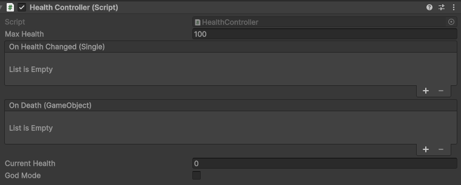
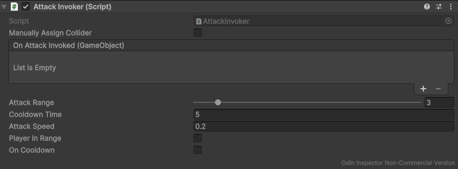
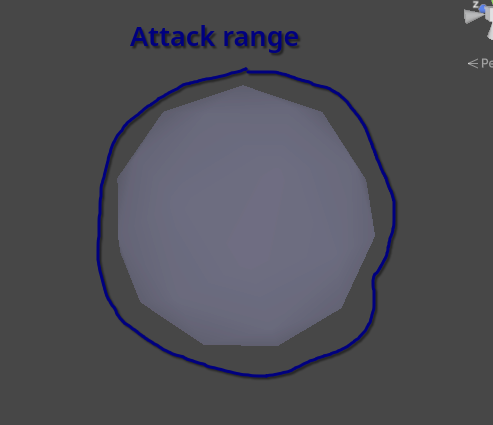
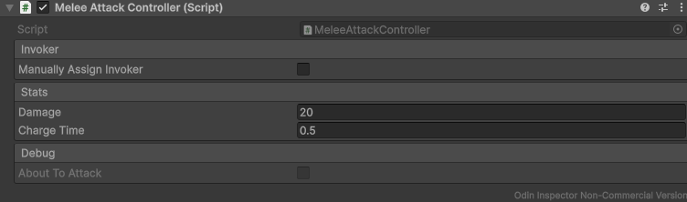
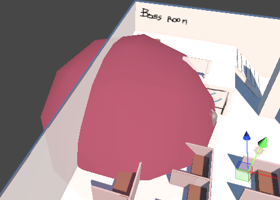
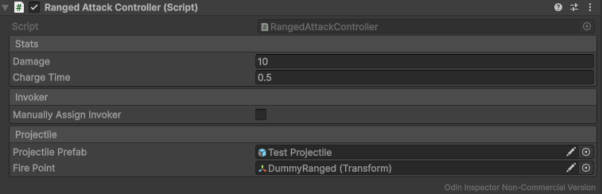
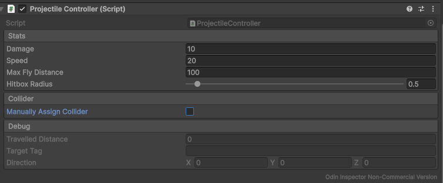

# Health & Attack systems
This branch contains the health system and simple attack systems for melee and ranged attack.

## Added files

```
├── Scenes/Showcase
│   └── MV
│       └── HealthAttackShowcase.tscn
└── Scripts
    ├── Combat
    │   ├── AttackInvoker.cs
    │   ├── HealthController.cs
    │   ├── IAttack.cs
    │   ├── MeleeAttackController
    │   ├── ProjectileController
    │   └── RangedAttackController
    ├── Managers
    │   └── GameManager.cs (incomplete, only combat-related functionality)
    ├── Misc
    │   └── ITargetable.cs
    └── Tests
        ├── AttakInvokerTests.cs
        ├── HealthTests.cs
        ├── MeleeAttackTests.cs
        ├── ProjectileTests.cs
        └── RangedAttackTests.cs

```

## Health System

Health system is implemented via the [```HealthController```](/Assets/Scripts/Combat/HealthController.cs) component.



Its main content is **current** and **maximum** health and methods for **damaging/healing** the entity (```TakeDamage(damage)/Heal(amount)```) and **death** of the entity (```Die()```), including appropriate events that fire when the respective situation happens (```OnHealthChanged/OnDeath```).

```Die()``` method is called automatically in ```TakeDamage()``` after the entity's health reaches zero. To prevent the entity from dying for debugging, you can use the **God mode** toggle in the editor.

## Attack system

The attack system for enemy types is divided into two main parts - the [```AttackInvoker```](Assets/Scripts/Combat/AttackInvoker.cs) and ```AttackController``` (either [```Melee```](Assets/Scripts/Combat/MeleeAttackController.cs) or [```Ranged```](Assets/Scripts/Combat/RangedAttackController.cs)).

### Attack Invoker



The attack invoker takes care of firing the attack when possible, specifically:
- When the player is in range
- When the attack is *not* on cooldown.

This version uses a collider for the attack range, eventually it is intended to use raycasting for more precise checks. The collider can either be assigned manually or automatically.

You can either set the attack cooldown in editor via ```Cooldown Time``` or ```Attack Speed``` fields, whichever you feel more comfortable with.

When the player enters the range, the component checks whether the attack is on cooldown or not. If not, it invokes the attack by triggering the event ```OnAttackInvoked```. It passes the desired targetable object (obtained from the target's ```ITargetable``` interface implementation) as an argument to be used by other systems.

The ```Attack Range``` is also visible in the editor:


### Melee attack



This component is responsible for melee attacking the player. When the attack is fired, the controller first waits for the ```Charge Time``` before actually attacking. For debugging, the attack range is turned
red in the editor while the attack is being charged:

 

### Ranged attack



This component handles ranged attacking. After the attack is fired, it spawns a projectile from the provided prefab at ```Fire Point``` and sets its enemy tag and direction towards the player. Then, the rest of the projectile's behavior is controlled by [```ProjectileController```](Assets/Scripts/Combat/ProjectileController.cs)



The projectile gradually moves itself in the given direction (provided via the ```Initialize()``` method). If destroys itself after either colliding with an object or after it travels beyond ```Max Fly Distance```. If it hits a collider with tag equal to ```Target Tag```, it deals damage to the object.