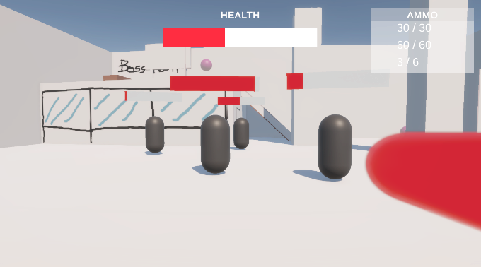
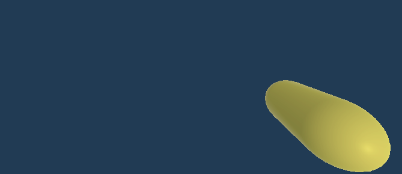
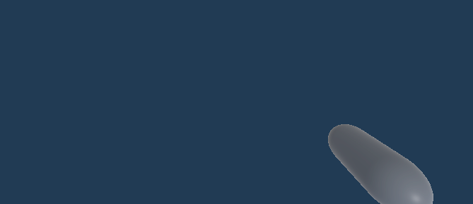
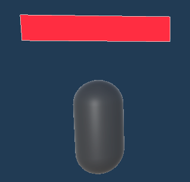
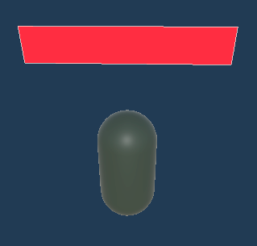
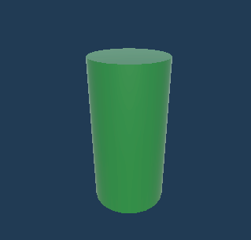
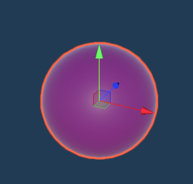

# Doom-like combat
Toto je prototyp pro doom-like combat v naší hře.
## Popis

### Co JE obsažené - Core princip combatu
- **Zdraví** 
- 3 základní typy **zbraní** 
 
 

    - V rámci prototypu se liší zejména kadencí, damagem a zpomalením (další features můžou být přidané potom).
    - Každá má vlastní **munici**. Může střílet pouze pokud má munici.
- Základní typy **nepřátel** 
    - Melee enemy 
        - 
        - V rámci prototypu pouze tupě nahání hráče
        - Pokud se dostane k hráči příliš blízko, hráč dostane damage
    - Ranged enemy 
        - 
        - Snaží se udržovat se od hráče odstup (non-polished)
        - Pokud je dostatečně blízko k hráči, vystřelí na něj
- **Doplňování** zdraví/munice
    - Jakmile hráč projde přes tyhle objekty, obnoví se mu zdraví/munice
    - Mají *cooldown*, po kterém se znovu obnoví (zamýšlená featura pro arénu, subject to change pro A-to-B průchod)
    - Zdraví 
        - 
        - Doplní hráči 10 zdraví (ze 100)
    - Munice
        - 
        - Doplní hráči polovinu munice do *všech* zbraní (subject to change, v závislosti na balancu)

### Co NENÍ obsažené 
- S čím se počítá do budoucna
    - Perky
        - Můžou mj. ovlivňovat rychlost pohybu, kadenci/damage zbraní ...
    - Využití environmentu
        - Heal přes banány -> slupka na zemi atd.
    - Parkour
    - Pokročilejší AI chování
    - Tweening, polish, "juice"
    - Originálnější typy zbraní (počet se pravděpodobně příliš nezmění)
- Další možné features
    - Nějaká verze melee combatu

### Aktuální herní smyčka

- Obecně je cílem **vyzabíjet všechny enemáky**
- Pokud hráč umře, hra se **vyresetuje**

#### Arena
- Na začátku hry se začnou spawnovat nepřátelé
- Cíl = zabít všechny nepřátele
    - V prototypu je natvrdo nastavený počet nepřátel, který se spawne
    - Noví nepřátelé se spawnou potom, co nějaký enemák umře
- Session "končí", když jsou všichni enemáci mrtví (v aréně žádní nezůstali)

#### A-to-B
- Hra začíná v úvodní místnosti ("Wall street ahh místnost") 
- Cíl = "Vyčistit" jednotlivé roomky a postupovat mapou (A-to-B průchod)
    - Po cestě jsou naházené neviditelné triggery
        - Po jejich překročení se aktivují enemáci v dané roomce (pouze jednou)
- Session "končí" vyzabíjením enemáků v poslední roomce (NFT roomka) 

## Controls
WSAD - Movement

Mouse - Camera movement

Space - Jump

LMB - Shoot (může se držet)

MMB Scroll - Změna zbraní

1/2/3 - Přehodí na zbraň 1/2/3

Enter - Resetuje aktuální level

## Scény
*Arena* - scéna pro arénu

*StartToFinish* - scéna pro A-to-B průchod