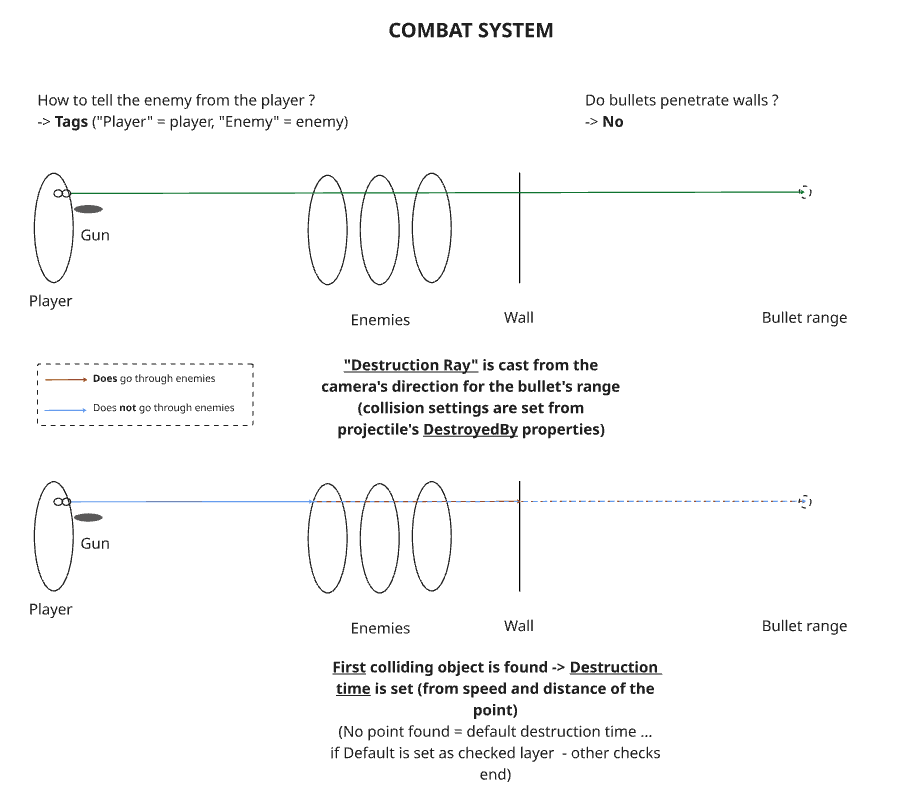
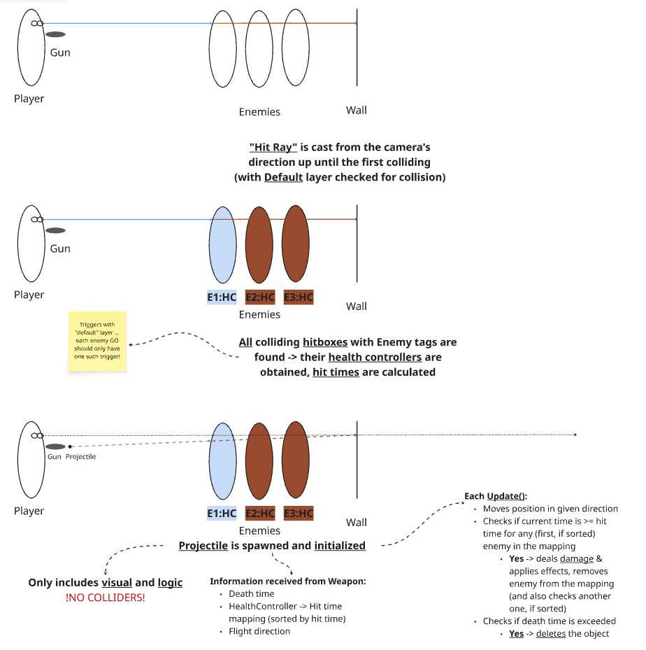
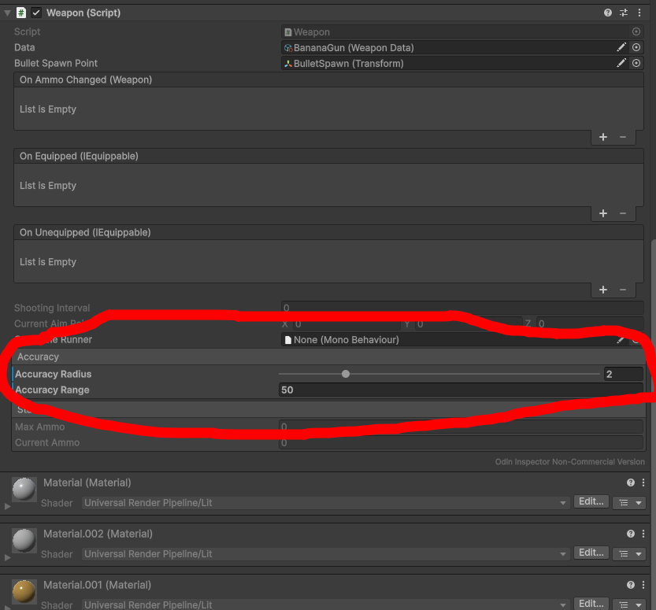
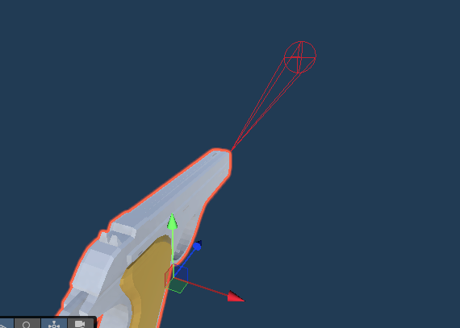

# New player projectile system
TLDR:
- New aiming system and firing logic introduced for player fired 

Added files:
```
.
├── Prefabs
│   └── Combat
│       ├── PlayerProjectile.prefab
│       ├── BananaGunPProjectile.prefab
│       ├── StaplerPProjectile.prefab
│       └── PenLauncherPProjectile.prefab
├── Scripts
│   └── Combat
│       └── Weapons
│           ├── IProjectile.cs
│           └── PlayerProjectileController.cs
```

## New shooting system for player guns
The design of the system is introduced in [Miro](https://miro.com/app/board/uXjVGsrDGbA=/)




**For the collision system to work on enemies, enemy objects should**
- Have their hitbox:
    - On an object in the *Default* layer
    - On an object tagged *Enemy*
    - Marked as a trigger
- Not have any other triggers in the *Default* layer on themselves

Now, there are **two** types of projectiles:
- **"Legacy" Projectile**
    - For enemy projectiles
    - Still physics&collision based, *can* be dodged
    - Uses [```ProjectileController```](../Assets/Scripts/Combat/Weapons/ProjectileController.cs)
    - Uses colliders
- **Player Projectile**
    - For player projectiles
    - Uses ray(sphere)casting, *cannot* be dodged
    - Uses [```PlayerProjectileController```](../Assets/Scripts/Combat/Weapons/PlayerProjectileController.cs)
    - NO colliders

## Aim dispersion
The aim accuracy can be set up from the [Weapon](../Assets/Scripts/Combat/Weapons/Weapon.cs) controller via the ```Accuracy Range``` and ```Accuracy Radius``` fields. What this means is, that at the ```Accuracy Range```, the bullets can be fired anywhere in a circle with radius equal to ```Accuracy Radius```. The calculated random distance from 0 to ```Accuracy Range``` is squared to keep the bullets close to the center most of the time.






## Tweaking movement & combat
- Enemy speeds, accelerations & attack ranges have been increased
- Player's movement has been slowed slightly
- Chimp's health has been slightly increased