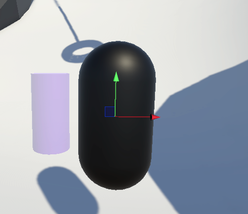
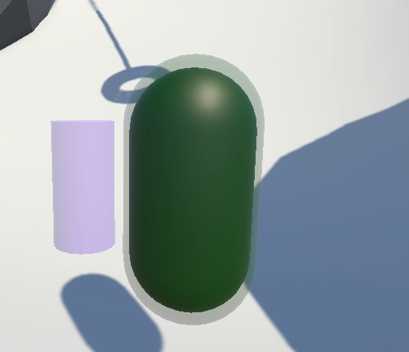
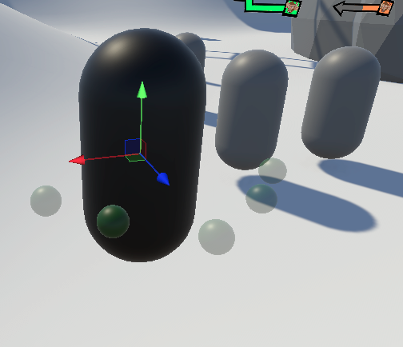
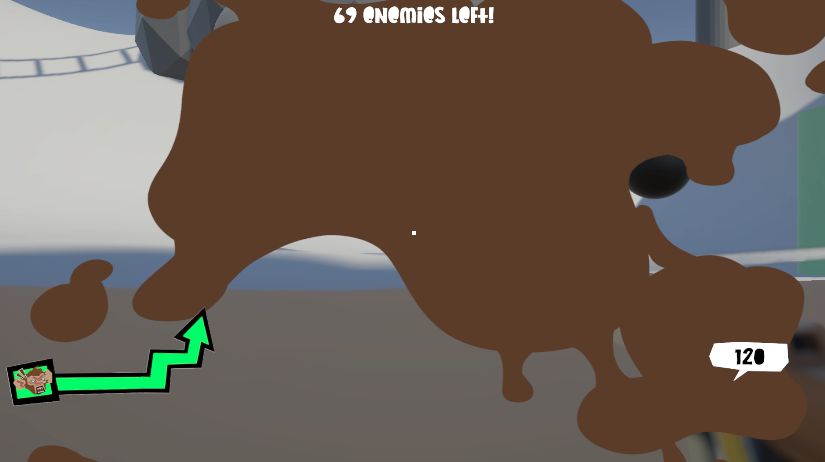

# Enemies
This branch introduces two enemy prefabs (`Chimp` and `Gorilla`) with navigation, health, and attack setups.

Following files are added/used:

```
.
├── Prefabs
│   ├── Enemies
│   │   ├── Chimp.prefab
│   │   └── Gorilla.prefab
│   └── Combat
│       └── Projectiles
│           ├── ChimpProjectile.prefab
│           └── PoopProjectile.prefab
├── Scripts
│   ├── Enemies
│   │   ├── EnemyFollowController.cs
│   │   └── GorillaController.cs
│   └── Combat
│       └── Attack
│           ├── AttackInvoker.cs
│           ├── MeleeAttackController.cs
│           └── RangedAttackController.cs
└── ProjectSettings
		└── TagManager.asset
```

## Range layer
New layer `Range` is defined in `ProjectSettings/TagManager.asset` (layer index 8).

It is used for enemy attack-range objects in prefabs:
- `Gorilla/AttackRange` (layer `Range`) - melee trigger radius object.
- `Chimp/RangedAttack` (layer `Range`) - ranged projectile trigger radius object.
- `Chimp/PoopAttack` (layer `Range`) - poop projectile trigger radius object.

These objects hold trigger `SphereCollider` components used by `AttackInvoker` to detect when the player is in range.

## Attack invoker
`AttackInvoker` drives enemy attacks by:
- monitoring enter/exit of player in the trigger sphere,
- invoking `OnAttackInvoked` when player is in range,
- enforcing cooldown between repeated attacks.

Each attack object has one `AttackInvoker` and one attack controller (`MeleeAttackController` or `RangedAttackController`).

## Gorilla prefab
`Gorilla` is a melee enemy with rage behavior.

Main object setup:
- Root `Gorilla`: `NavMeshAgent`, `EnemyFollowController`, `HealthController`, `GorillaController`.
- Child `Capsule`: visual/collider body.
- Child `AttackRange` (layer `Range`):
	- `SphereCollider` (trigger, radius `1.25`),
	- `AttackInvoker` (`_attackRange = 1.25`),
	- `MeleeAttackController` (`Damage = 20`, `ChargeTime = 0.5`).

`GorillaController` enrages below 50% health and increases follow speed + melee aggression (damage/charge-time tuning), while changing material.

## Chimp prefab
`Chimp` is a ranged enemy with two independent ranged attacks.

Main object setup:
- Root `Chimp`: `NavMeshAgent`, `EnemyFollowController`, `HealthController`.
- Child `FirePoint`: spawn point for projectiles.
- Child `Capsule (1)`: visual/collider body.
- Child `RangedAttack` (layer `Range`):
	- `SphereCollider` (trigger, radius `10`),
	- `AttackInvoker` (`_attackRange = 10`),
	- `RangedAttackController` (`Damage = 10`, `ChargeTime = 0.5`, projectile = `ChimpProjectile`).
- Child `PoopAttack` (layer `Range`):
	- `SphereCollider` (trigger, radius `8`),
	- `AttackInvoker` (`_attackRange = 8`),
	- `RangedAttackController` (`Damage = 0`, `ChargeTime = 0.7`, projectile = `PoopProjectile`).

Both ranged attack controllers fire from the same `FirePoint`, each controlled by its own invoker/range.

## Visualizers (normal / poison / slowdown)


Enemies use optional visual feedback for active debuffs:
- **Normal**: no debuff visualizers are active.
- **Poison**: `HealthController` enables `_poisonEffectRenderer` when poison starts and disables it after all poison ticks.
- **Slowdown**: `EnemyFollowController` enables entries from `_slowdownVisualizers` when slowdown reduces speed; visualizers are reset when slowdown ends.

Poison state example:


Slowdown state example:


## Poop effect
`PoopAttack` on `Chimp` fires `PoopProjectile` through `RangedAttackController`. The projectile has `PoopEffect`, which calls `ScreenEffectsManager.ShowPoopSplashScreen(duration)` on hit.

The poop splash is a fullscreen UI overlay that fades out over time:


## Scene usage
In this branch, both enemies are showcased in `Assets/Scenes/Showcase/MV/PlayerEnemiesShowcase.unity` as `Gorilla` and `Chimp`.
