# Enemy Navigation
This branch deals with simple enemy navigation system.

Following files are added: 

```
.
├── Scenes
│   ├── Showcase
│   │   └── MV
│   │       └── NavigationShowcase.tscn 
│   └── UnityTests
│       └── NavigationTests (invalidated)
│           ├── ChokepointTest (invalidated)
│           │   └── NavMesh-NavMesh.asset (invalidated)
│           └── ChokepointTest.tscn (invalidated)
├── Prefabs
│   └── Navigation
│       ├── NavMesh.prefab
│       └── TrafficZone.prefab
└── Scripts
    ├── Enemies
    │   └── Navigation
    │       ├── EnemyFollowController.cs
    │       ├── TrafficManager.cs
    │       └── TrafficZone
    └── Tests
        ├── EnemyFollowTests.cs (invalidated?)
        └── TrafficManagerTests.cs   
```

## Flanking behavior

### How it works
The entire design "sketch" is shown in [Miro](https://miro.com/app/board/uXjVGsrDGbA=/?moveToWidget=3458764670148546895&cot=14).

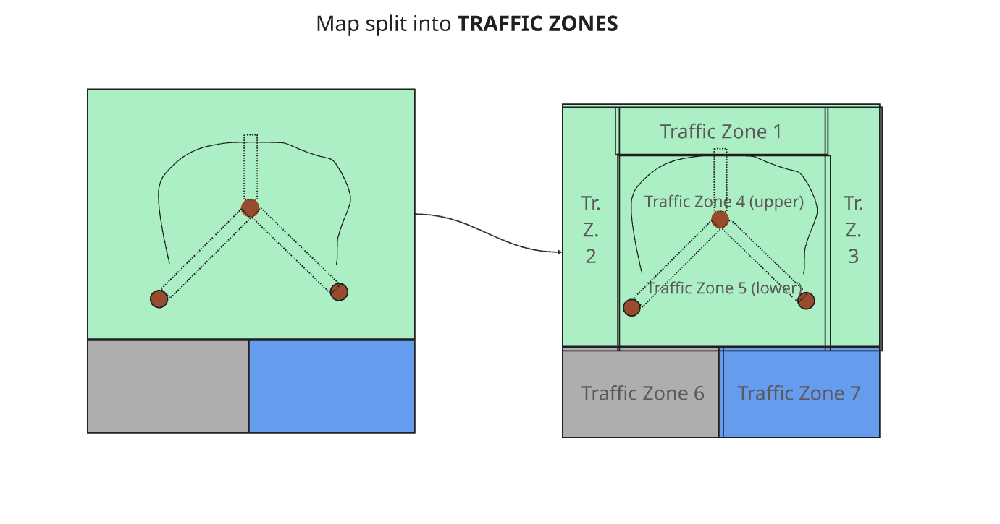

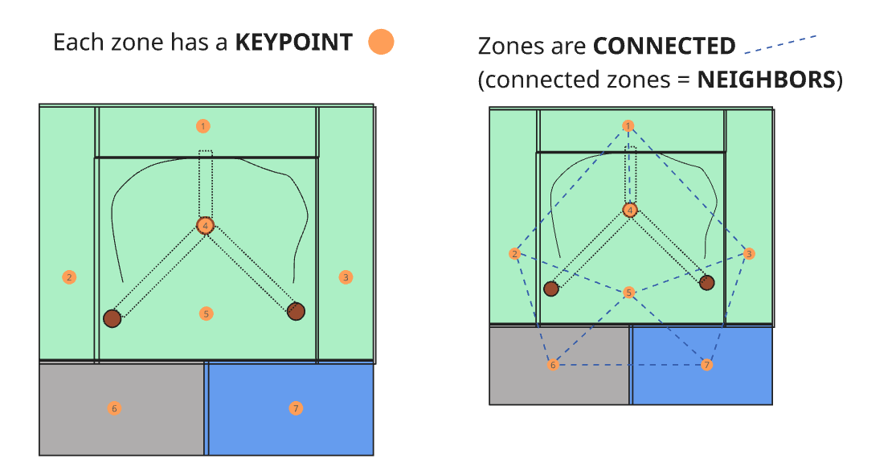

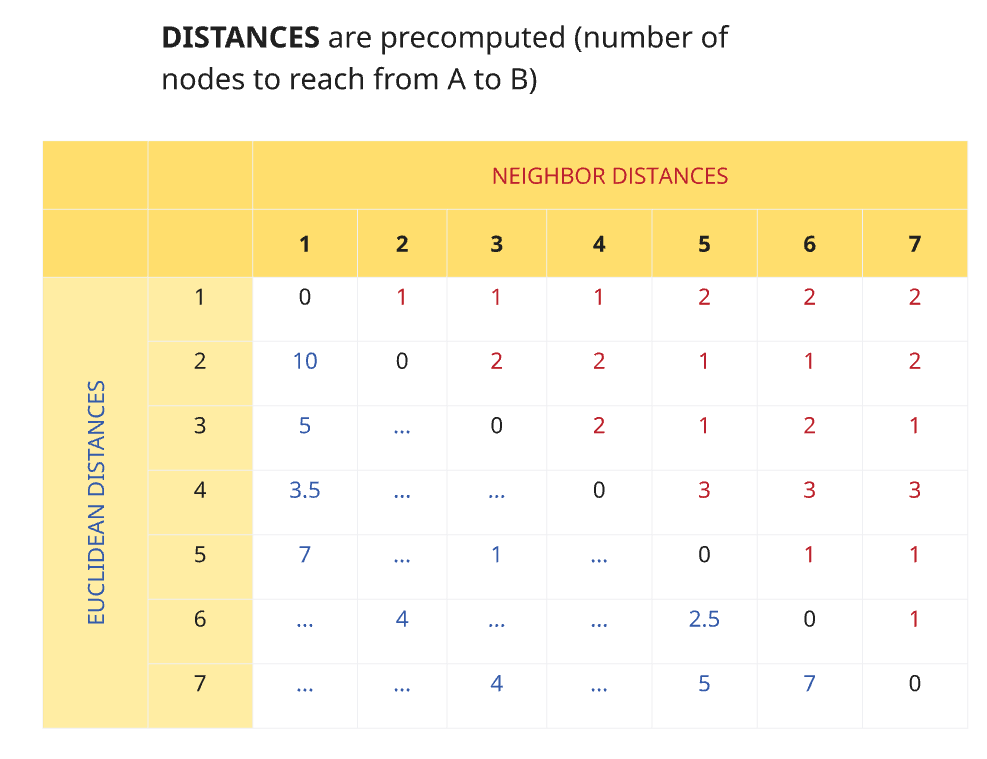

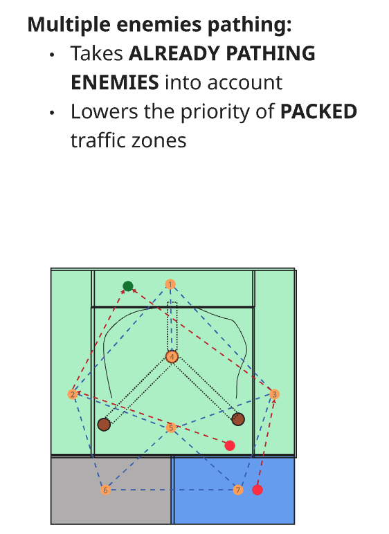

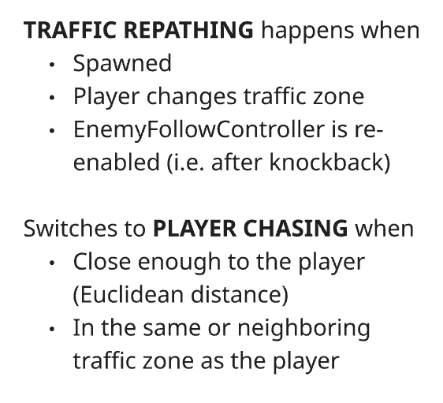

### How to set up
#### 1. Setting up the traffic zones
-  Place a **TrafficZone** prefab in the scene.
- Put the instance in the desired zone position and set its **Keypoint** somewhere in that area close to the NavMesh (enemies will path through the keypoint). 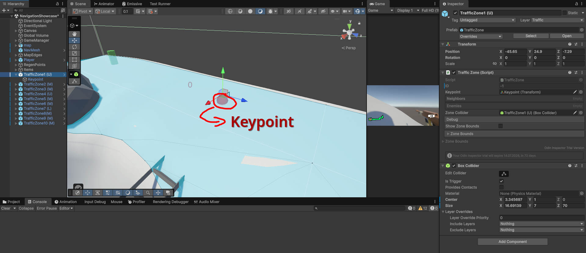
    - Black number = Zone ID (will be setup later)
    - Red number = Number of enemies pathing through zone (unrelated to setup)
-  Change the zone area via its **Box collider** (use *Edit collider* button). If you want the area to be highlighted, toggle the *Show Zone Bounds* option in the *Traffic Zone* script.
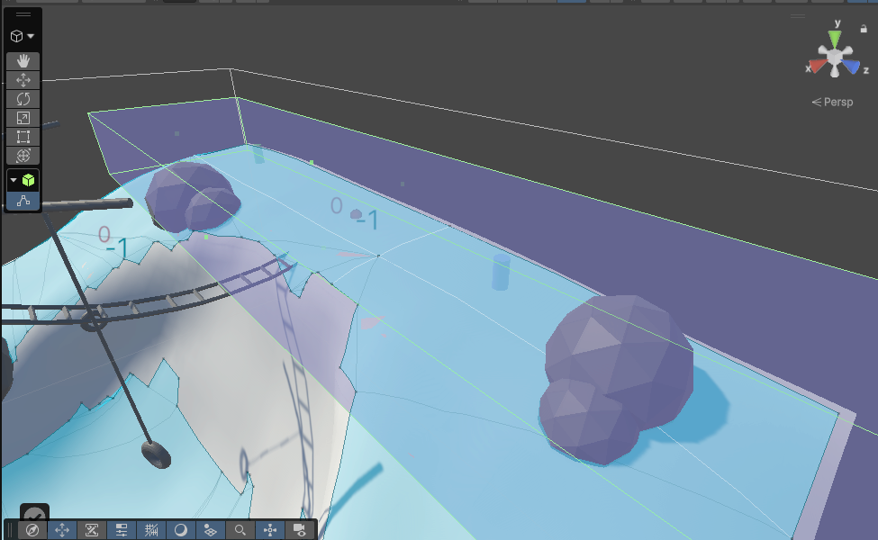
    - **If you want to CONNECT this zone to adjacent zones, make their zone areas INTERSECT with each other!**
    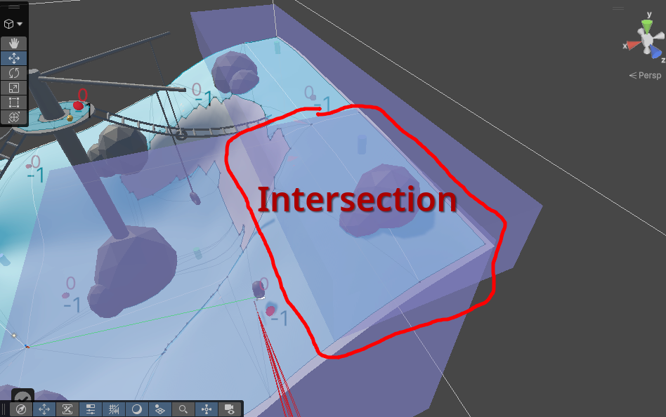

#### 2. Setting up the traffic manager
- In the GameManager instance in your scene, find the **Traffic Manager** component
- Click on *Setup Zones*
    - The zones should now have:
        - Their IDs assigned (they are pretty random, but **no two zones should have the same ID**)
        - Visible connections to their neighboring zones
            - In case there's a missing or extra connection, move the zone areas s.t. they do not collide with each other.
    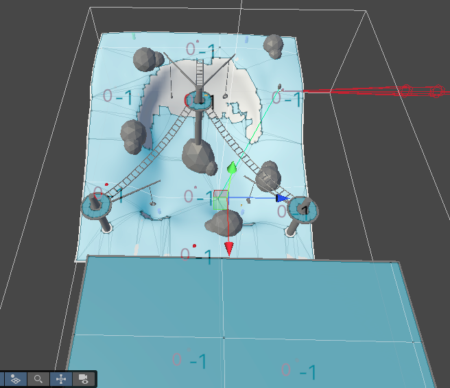
    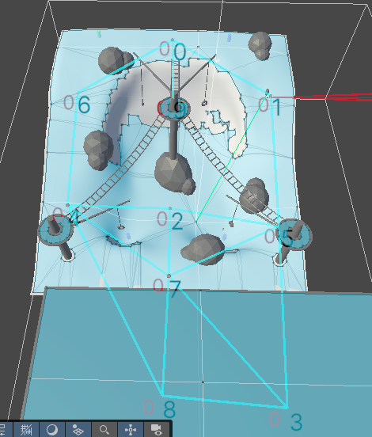
    - You should see all zones and their distances precomputed in the Traffic Manager, under the **Precomputed zone data** tab
    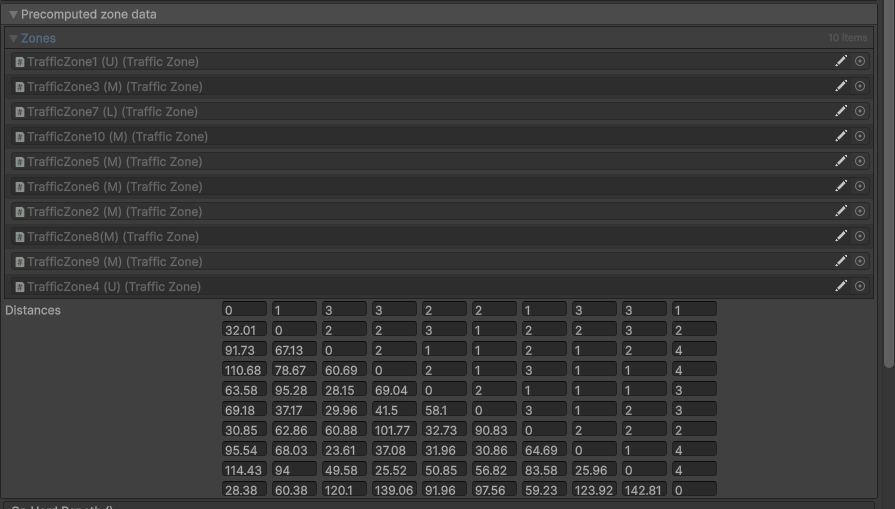
    - **DON'T FORGET TO SAVE THE SCENE BEFORE ENTERING PLAY MODE** 

- For changing the runtime behavior, you can change the pathfinding settings. Hovering over each sorting rule displays an explanatory tooltip. 
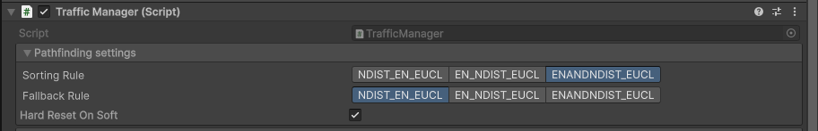
    - **NOTE**: The default settings are the most stable and provided the seemingly best results. **Especially changing the fallback rule might yield very unpredictable results, as other rules sometimes do not find the path properly!** This might get fixed in the future

### Implementation
If the enemy is close enough to the player (either distance-wise, or in the same or the neighboring zone), the pathfinding switches to the legacy system described in the parts below.

Otherwise, it requests a new path from the traffic manager. The traffic manager tries to find the best path between the enemy's and the player's traffic zones, starting from the enemy's traffic zone. For the currently tested zone, it picks up the best neighbor chosen by the selected sorting policy. While doing that, it updates the number of enemies pathing through all the zones in such path.

When the enemy receives the path, it moves towards the keypoint of the next traffic zone on the path. When it reaches the keypoint, it either moves towards the keypoint of the next zone (updating the current zone's number of enemies pathing through it), or switches to the legacy system, if close enough to the player.

## NavMesh
Unity's NavMesh system is being used.

### To create a NavMesh in your scene:

1. Change the layer of your map and obstacles into ```Navigation```
2. Add ```NavMesh``` prefab to your scene
3. In it's ```NavMesh Surface``` component, click on "Bake" 

## Legacy movement system (still used for player chasing)

*NOTE: New functionalities of the EnemyFollowController were described above*

This component is responsible for controlling enemy follow properties. It directly sets properties of ```NavMeshAgent``` component from Unity's NavMesh system. ```Avoidance Priority Range``` serves to assign each agent a random avoidance priority from such range, to prevent weird chokepoint movements.

Internally, it recalculates it's desired position every ```Update Path Interval``` seconds. If the distance towards ```Chase Target``` is higher than ```Chase Distance``` (with some offset), it goes towards the chase target. If the distance is lower, it chooses a point away from the player in that distance. (so far in the direction "behind" the agent, future tweaks might include random choice).

The chase distance is highlighted as a <span style="color:red">**red**</span> wired sphere in the editor . During play mode, it also shows a line to the current movement destination. If the agent starts avoiding the target, both the line and the sphere turn <span style="color:green">**green**</span>.  

## Showcase
The showcase scene used is located in ```Assets/Scenes/Showcase/MV/NavigationShowcase.unity```. 