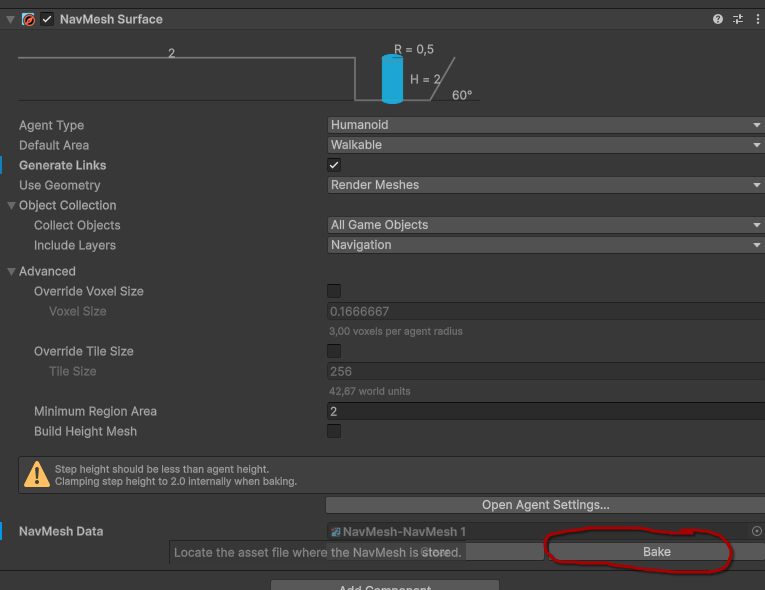
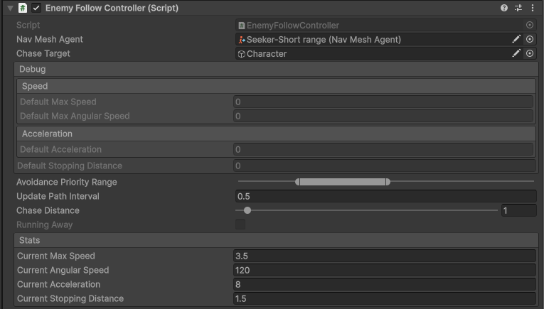
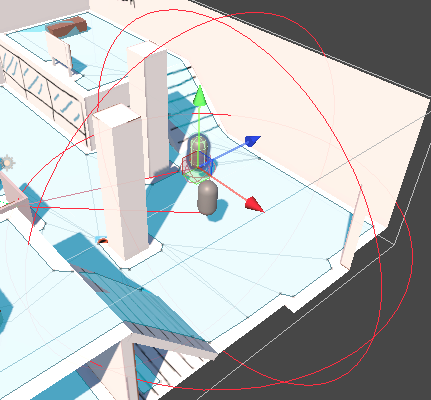

# Enemy Navigation
This branch deals with simple enemy navigation system.

Following files are added: 

```
.
├── Scenes
│   ├── Showcase
│   │   └── MV
│   │       └── NavigationShowcase.tscn
│   └── UnityTests
│       └── NavigationTests
│           ├── ChokepointTest
│           │   └── NavMesh-NavMesh.asset
│           └── ChokepointTest.tscn
├── Prefabs
│   └── Navigation
│       └── NavMesh.prefab
└── Scripts
    ├── Enemies
    │   └── EnemyFollowController.cs
    └── Tests
        └── EnemyFollowTests.cs
```

## NavMesh
Unity's NavMesh system is being used.

To create a NavMesh in your scene:

1. Change the layer of your map and obstacles into ```Navigation```
2. Add ```NavMesh``` prefab to your scene
3. In it's ```NavMesh Surface``` component, click on "Bake" 

## Enemy Follow Controller


This component is responsible for controlling enemy follow properties. It directly sets properties of ```NavMeshAgent``` component from Unity's NavMesh system. ```Avoidance Priority Range``` serves to assign each agent a random avoidance priority from such range, to prevent weird chokepoint movements.

Internally, it recalculates it's desired position every ```Update Path Interval``` seconds. If the distance towards ```Chase Target``` is higher than ```Chase Distance``` (with some offset), it goes towards the chase target. If the distance is lower, it chooses a point away from the player in that distance. (so far in the direction "behind" the agent, future tweaks might include random choice).

The chase distance is highlighted as a <span style="color:red">**red**</span> wired sphere in the editor . During play mode, it also shows a line to the current movement destination. If the agent starts avoiding the target, both the line and the sphere turn <span style="color:green">**green**</span>.  

## Showcase
In the scene, you can see two agents - one with short avoidance distance, the other one with longer. One agent should closely follow the player, the other one should follow them only up to a certain distance. 