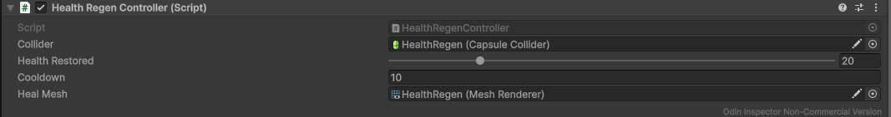
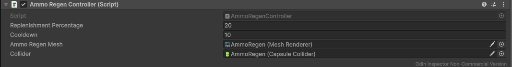
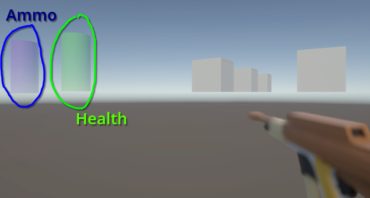

# Health & Ammo Regen
This branch deals with simple health and ammo regeneration pads.

Following files are added:

```
.
├── Scenes
│   └── Showcase
│       └── MV
│           └── HealthAttackShowcase.unity
├── Prefabs
│   └── Combat
│       └── Regen
│           ├── AmmoRegen.prefab
│           └── HealthRegen.prefab
└── Scripts
	└── Combat
		└── Regen
			├── AmmoRegenController.cs
			└── HealthRegenController.cs
```

## Health Regen Controller


This component restores player health when the player steps into the pad trigger.

It checks for a collider tagged as `Player`, gets `HealthController` from the player parent hierarchy, and heals by `Health Restored`. Once activated, the pad is disabled for `Cooldown` seconds, and its mesh is hidden during cooldown. After cooldown expires, the pad is enabled again and can heal once more.

## Ammo Regen Controller


This component replenishes ammo for all equipped weapons when the player steps into the pad trigger.

It checks for a collider tagged as `Player`, gets `EquipmentManager` from the player parent hierarchy, and calls `ReloadPercent` on each equipped `Weapon` using `Replenishment Percentage`. Once activated, the pad is disabled for `Cooldown` seconds, and its mesh is hidden during cooldown. After cooldown expires, the pad is enabled again and can replenish ammo once more.

## Showcase


In the showcase scene, the player can interact with both regeneration pads: one restores health and the other replenishes ammo. Each pad has its own cooldown and visual feedback by hiding its mesh while unavailable.
This setup is demonstrated in `HealthAttackShowcase` scene.